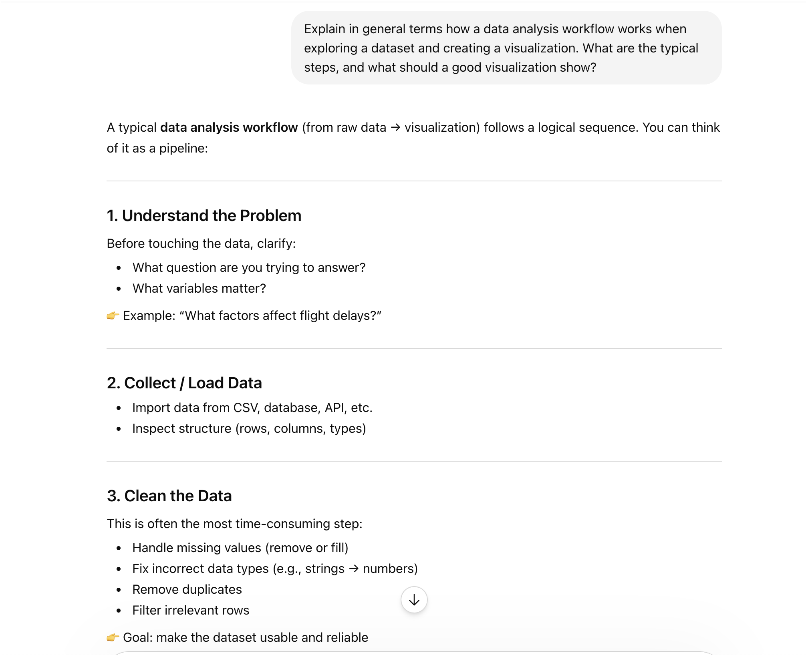

# Busiest Airports Analysis

This section examines passenger traffic trends for six major airports from 2020 through 2025. Table @tbl-airports summarizes the annual passenger totals for the selected airports, while Figure @fig-airports shows how passenger traffic changed over time. Together, these visualizations show both the overall scale of passenger traffic and the differences in recovery patterns across airports.

The table is useful for comparing exact passenger totals by airport and year. In contrast, the line graph makes it easier to see changes over time, especially the declines and rebounds that occurred across the 2020 to 2025 period. Looking at both visualizations together helps show that some airports recovered more steadily, while others experienced sharper increases after the lowest-traffic years. This combination of a table and a plot provides a clearer understanding of the busiest-airports context than either display would on its own.

```{r}
#| label: setup
library(rvest)
library(tidyverse)
library(knitr)
library(kableExtra)
library(grid)

airportWikiData <- read_html(
  x = "https://en.wikipedia.org/wiki/List_of_busiest_airports_by_passenger_traffic"
) |>
  html_elements(css = "table") |>
  html_table()

airports_2025 <- airportWikiData[[2]] |>
  mutate(year = 2025, .before = Rank)

airports_2024 <- airportWikiData[[3]] |>
  mutate(year = 2024, .before = Rank)

airports_2023 <- airportWikiData[[4]] |>
  mutate(year = 2023, .before = Rank)

airports_2022 <- airportWikiData[[5]] |>
  mutate(year = 2022, .before = Rank)

airports_2021 <- airportWikiData[[6]] |>
  mutate(year = 2021, .before = Rank)

airports_2020 <- airportWikiData[[7]] |>
  mutate(year = 2020, .before = Rank)

targetAirports <- c("ATL", "FRA", "PKX", "PHX", "ORD", "LHR")

airportData6 <- bind_rows(
  airports_2020,
  airports_2021,
  airports_2022,
  airports_2023,
  airports_2024,
  airports_2025
) |>
  rename(
    passengers = Totalpassengers,
    percentChange = `%change`
  ) |>
  separate_wider_delim(
    cols = `Code(IATA/ICAO)`,
    delim = "/",
    names = c("IATA", "ICAO"),
    too_few = "align_start",
    too_many = "merge"
  ) |>
  filter(IATA %in% targetAirports) |>
  mutate(
    across(
      .cols = c(passengers, percentChange),
      .fns = ~ parse_number(.x)
    )
  )

airportData6_wide <- airportData6 |>
  select(Airport, IATA, year, passengers) |>
  pivot_wider(
    names_from = year,
    values_from = passengers
  )


```

```{r}
#| label: tbl-airports
#| tbl-cap: "Total annual passengers from 2020 to 2025 for six busy airports."

options(knitr.kable.NA = "")

airportData6_wide |>
  kable(
    digits = 4,
    format.args = list(big.mark = ","),
    col.names = c("Airport", "IATA", "2020", "2021", "2022", "2023", "2024", "2025"),
    align = c("l", "c", "c", "c", "c", "c", "c", "c"),
    booktabs = TRUE
  ) |>
  kable_classic(full_width = FALSE) |>
  kable_styling(
    latex_options = c("hold_position", "scale_down"),
    font_size = 9
  )
```{r}
#| label: fig-airports
#| fig-cap: "Passenger traffic trends from 2020 to 2025 for six busy airports."

psuPalette <- c(
  "#1E407C", "#BC204B", "#3EA39E",
  "#E98300", "#999999", "#AC8DCE"
)

airportData6 |>
  mutate(
    passengers_mil = passengers / 1000000
  ) |>
  ggplot(
    aes(
      x = year,
      y = passengers_mil,
      color = IATA,
      linetype = IATA,
      group = IATA
    )
  ) +
  geom_line(linewidth = 0.9) +
  geom_point(size = 2) +
  scale_color_manual(values = psuPalette) +
  scale_x_continuous(
    breaks = 2020:2025
  ) +
  labs(
    x = "Year",
    y = "Total passengers (in millions)",
    color = "Airport",
    linetype = "Airport"
  ) +
  theme_bw() +
  theme(
    legend.position = "bottom",
    plot.title = element_text(size = 12),
    axis.title = element_text(size = 11),
    axis.text = element_text(size = 10),
    legend.title = element_text(size = 10),
    legend.text = element_text(size = 9)
  )
```


```qmd
# Monte Carlo Numerical Integration

This section uses Monte Carlo simulation to estimate the value of the definite integral of the standard normal density over the interval from -4 to 4. The method works by randomly generating points inside a rectangular window, identifying which points fall on or below the density curve, and then multiplying that proportion by the area of the rectangle. In this case, the rectangular window has width 8 and height 0.4, so its area is 3.2.

Figure @fig-mc-small shows the simulation at four different resolutions. When the number of simulated points is small, the estimated value varies more because random fluctuation has a stronger effect on the proportion of points below the curve. As the number of points increases, the point cloud fills the rectangle more evenly and the estimated integral becomes more stable. This visual pattern suggests that the Monte Carlo estimate improves as the sample size increases.

Based on the higher-resolution panels, the value of the integral appears to be approximately 1. This conclusion is reasonable because the standard normal density has almost all of its probability mass between -4 and 4, and the estimates in the larger simulations move closer to 1 than the estimates in the lower-resolution panels. The two largest panels provide the strongest support for this conclusion because they show less variability and better approximate the area under the curve.

```{r}
#| label: fig-mc-small
#| fig-cap: "Monte Carlo numerical integration for the standard normal density using four simulation resolutions."
#| fig-width: 10
#| fig-height: 8

library(tidyverse)
library(patchwork)

set.seed(184)

make_mc_plot <- function(n) {
  mc_df <- tibble(
    x = runif(n, -4, 4),
    y = runif(n, 0, 0.4)
  ) |>
    mutate(
      density_y = dnorm(x, mean = 0, sd = 1),
      flag = if_else(y <= density_y, "on/below", "above"),
      hit = if_else(flag == "on/below", 1, 0)
    )

  est_int <- mean(mc_df$hit) * (4 - (-4)) * (0.4 - 0)

  ggplot(mc_df, aes(x = x, y = y, color = flag)) +
    geom_point(alpha = 0.6, size = 1.5) +
    stat_function(
      fun = dnorm,
      args = list(mean = 0, sd = 1),
      xlim = c(-4, 4),
      linewidth = 1.2,
      color = "blue"
    ) +
    scale_color_manual(values = c("above" = "#F8766D", "on/below" = "#00BFC4")) +
    scale_x_continuous(limits = c(-4, 4)) +
    scale_y_continuous(limits = c(0, 0.4)) +
    labs(
      title = paste("Monte Carlo Integration Example, n =", n),
      subtitle = paste("Est. Numerical Integration:", round(est_int, 4)),
      x = "x",
      y = "y",
      color = "flag"
    ) +
    theme_bw() +
    theme(legend.position = "bottom")
}

plot10 <- make_mc_plot(10)
plot100 <- make_mc_plot(100)
plot1000 <- make_mc_plot(1000)
plot10000 <- make_mc_plot(10000)

(plot10 + plot100) / (plot1000 + plot10000) 
```
Planning and Prompting: Generic Response

To explore how generative AI can support data analysis, I used a generic prompt that asks for a broad explanation of a typical data analysis workflow. The prompt I used was:

"Explain in general terms how a data analysis workflow works when exploring a dataset and creating a visualization. What are the typical steps, and what should a good visualization show?"

Figure @fig-generic-response shows the response generated by the AI tool.

```{r}
#| label: fig-generic-response
#| fig-cap: "Response generated by a generative AI tool using a generic prompt about data analysis workflows."
#| out-width: "80%"


```

The AI-generated response describes a general workflow for data analysis, including steps such as understanding the dataset, cleaning and organizing the data, and creating visualizations to communicate patterns. It emphasizes that good visualizations should clearly present trends, comparisons, and key insights in a way that is easy for the audience to understand.

While this response provides a useful high-level overview, it remains broad and does not address the specific details of the dataset or analysis in this assignment. Compared to more targeted prompts, the generic response lacks concrete guidance on implementation decisions. However, it is still valuable for building a general understanding of how data analysis and visualization should be approached.

## Planning and Prompting: Narrative Text

The plan-informed generative AI response provides more targeted and context-specific guidance compared to the generic response. While the generic prompt explains a broad data analysis workflow, it does not incorporate the specific structure, variables, or goals of this assignment. In contrast, the plan-informed response aligns more closely with the dataset and analysis task, offering clearer direction on how to approach the wrangling and visualization steps.

From the visualizations created in this assignment, it is evident that a structured and context-aware approach leads to more meaningful results. For example, the Monte Carlo simulation plots clearly demonstrate how increasing the number of sampled points improves the stability and accuracy of the estimated integral. This reflects a deliberate implementation choice that would not be directly suggested by a generic response alone.

Comparing these approaches highlights that generic prompts are useful for building foundational understanding, but they lack the specificity needed for effective implementation. Plan-informed prompts, on the other hand, bridge this gap by connecting general principles to the actual problem context. My own analysis builds on both: I used the general workflow as a starting point, but relied on a more tailored approach to correctly implement the simulation and produce interpretable visualizations.

Overall, this exercise demonstrates that generative AI is most effective when prompts are specific and aligned with the task. Generic prompts provide useful high-level guidance, but deeper insights and accurate results require incorporating problem-specific details and critical thinking.

## Self-Reflection

Throughout this assignment, I developed a stronger understanding of how data analysis workflows are structured and implemented in practice. One key takeaway is the importance of moving from a general idea to a concrete implementation. For example, in the Monte Carlo simulation section, I learned how increasing the number of sampled points leads to more stable and accurate estimates. This helped me better understand the relationship between randomness, sample size, and convergence.

Another important lesson was the role of data wrangling in preparing data for analysis. Before creating visualizations, I had to carefully organize the data and define variables such as whether points fall above or below the curve. This step was essential for ensuring that the results were meaningful and interpretable.

I also learned how visualization design affects interpretation. By creating multiple plots at different resolutions, I was able to clearly see how patterns become more stable as the sample size increases. This reinforced the idea that visualizations are not just for presentation, but also for understanding the underlying process.

Overall, this assignment helped me connect theoretical concepts with practical implementation, and improved my ability to think critically about both data analysis and visualization.

\newpage

## GenAI Usage Appendix

### Usage 1: Generic Prompt Response

- **Tool Used:** ChatGPT (OpenAI GPT-5.3)
- **Date:** 2026-04-13

- **Prompt Used:**
"Explain in general terms how a data analysis workflow works when exploring a dataset and creating a visualization. What are the typical steps, and what should a good visualization show?"

- **Response:**
A typical data analysis workflow (from raw data → visualization) follows a logical sequence:

1. Understand the problem  
   - Identify the question being asked  
   - Determine relevant variables  

2. Collect / load data  
   - Import data from files, databases, or APIs  
   - Inspect structure (rows, columns, types)  

3. Clean the data  
   - Handle missing values  
   - Correct data types  
   - Remove duplicates  
   - Filter irrelevant observations  

4. Explore and analyze  
   - Summarize statistics  
   - Identify patterns and relationships  

5. Visualize results  
   - Use plots to communicate trends and comparisons  
   - Ensure clarity, labeling, and readability  

Good visualizations should clearly communicate patterns, comparisons, and key insights in a way that is easy for the audience to understand.

---


## Code Appendix

```{r}
# Monte Carlo Integration Code

library(tidyverse)
library(patchwork)

# Function to generate random points
mc_points <- function(n, x_min, x_max, y_min, y_max) {
  x <- runif(n, min = x_min, max = x_max)
  y <- runif(n, min = y_min, max = y_max)
  data.frame(x = x, y = y)
}

# Function to create Monte Carlo plot
make_mc_plot <- function(n) {
  set.seed(184)
  
  mc_df <- mc_points(n, -4, 4, 0, 0.4) |>
    mutate(
      density_y = dnorm(x, mean = 0, sd = 1),
      flag = case_when(
        y > density_y ~ "above",
        TRUE ~ "on/below"
      ),
      hit = case_when(
        flag == "on/below" ~ 1,
        TRUE ~ 0
      )
    )
  
  est_int <- mean(mc_df$hit) * (4 - (-4)) * (0.4 - 0)
  
  ggplot(mc_df, aes(x = x, y = y, color = flag)) +
    geom_point(alpha = 0.6, size = 1.8) +
    stat_function(
      fun = dnorm,
      args = list(mean = 0, sd = 1),
      xlim = c(-4, 4),
      linewidth = 1.2,
      color = "blue"
    ) +
    scale_color_manual(values = c("above" = "#F8766D", "on/below" = "#00BFC4")) +
    labs(
      title = paste("Monte Carlo Integration Example, n =", n),
      subtitle = paste("Est. Numerical Integration:", round(est_int, 4)),
      x = "x",
      y = "y",
      color = "flag"
    ) +
    theme_bw()
}

# Generate plots
plot10 <- make_mc_plot(10)
plot100 <- make_mc_plot(100)
plot1000 <- make_mc_plot(1000)
plot10000 <- make_mc_plot(10000)

# Combine plots
(plot10 + plot100) / (plot1000 + plot10000)
